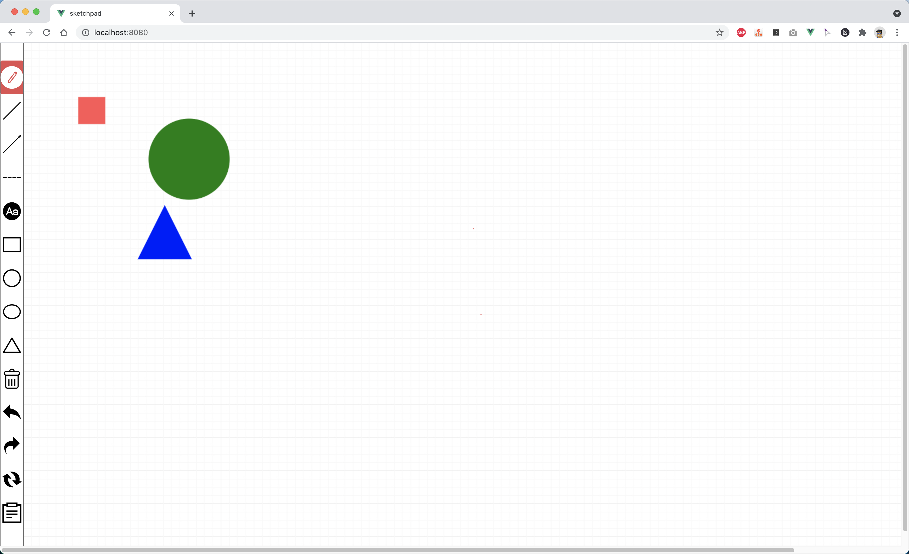

# sketchpad

>使用vue.js和fabric.js构建的web画板，中间使用vuex来做状态的控制，目前支持画箭头、虚线、矩形、原型、文字等功能，删除功能和回退功能待开发中

效果图如下：


> [x] 直线
  [x] 箭头
  [x] 虚线
  [x] 输入文字
  [x] 矩形
  [x] 标准圆形
  [x] 椭圆形
  [x] 等腰三角形
  [x] 删除、移动、复位
  []  历史记录
### Build Setup

``` bash
# install dependencies
npm install

# serve with hot reload at localhost:8080
npm run dev

# build for production with minification
npm run build

# build for production and view the bundle analyzer report
npm run build --report
```

For a detailed explanation on how things work, check out the [guide](http://vuejs-templates.github.io/webpack/) and [docs for vue-loader](http://vuejs.github.io/vue-loader).
